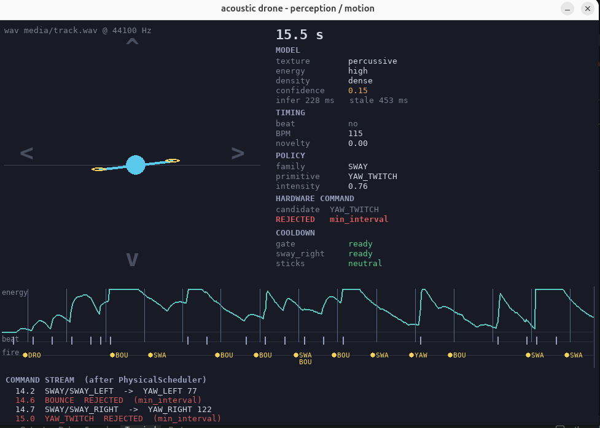
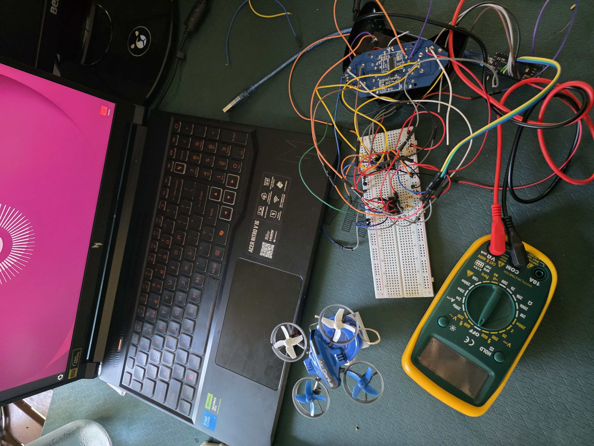
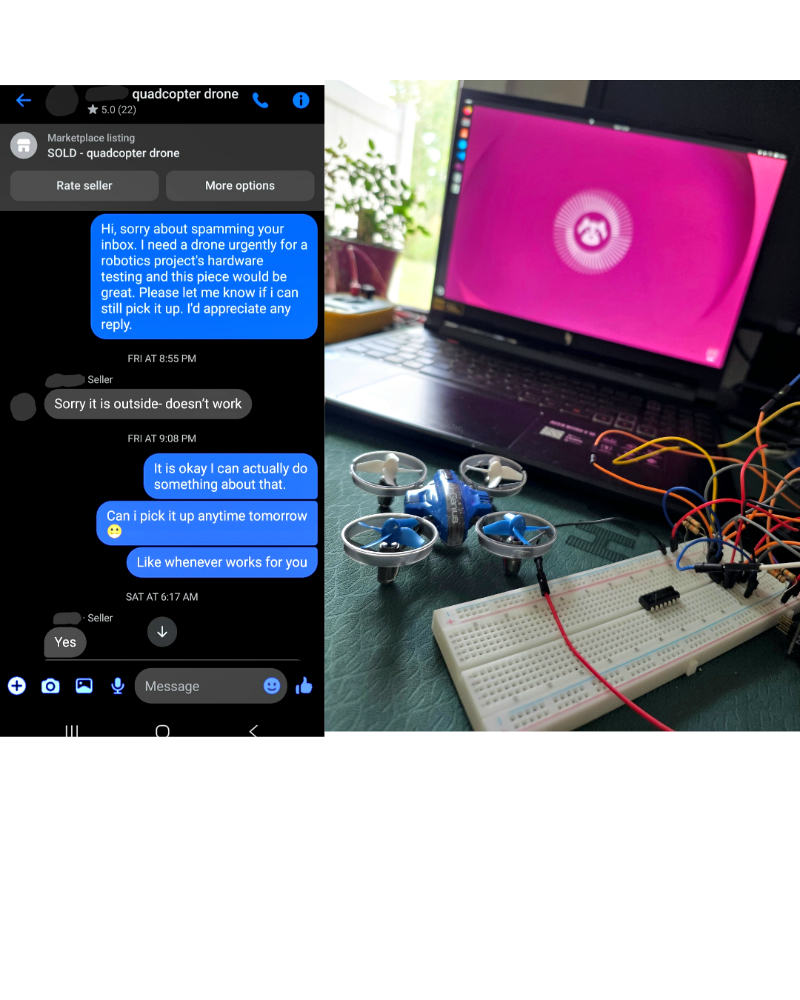

# Acoustic Physical AI Micro-Drone

> I took a cheap toy drone and turned it into a programmable robot that listens to music and moves along with it in real time.



*The screenshot above is not a mockup. It is a rehearsal tool that shows the exact
button presses the real Arduino would send to the drone's controller while a song plays.*

## Highlights



* **A $10 "broken" drone, made programmable.** I did not crack the drone's radio signal or replace its flight computer. Instead, a small circuit presses the buttons on the original handheld controller electronically. The drone's own radio, balance system, and motors keep working exactly as they were designed to.
* **Two ways of listening at once.** A fast beat tracker runs about 31 times per second to catch the rhythm. A slower AI model runs on the graphics card about twice per second to figure out what kind of music is playing, such as heavy, calm, or building up. The two run separately, so a slow AI answer never throws off the beat timing.
* **It moves on the beat, not after it.** The software predicts when the next beat will land and schedules the move ahead of time. The Arduino then fires the button press at the exact moment using its own precise timer, so a busy laptop cannot make the timing sloppy.
* **Safety rules live on the hardware.** The Arduino enforces its own limits, such as rest time between presses, blocking opposite moves at the same time, capping how many buttons are held at once, and stopping everything if the laptop connection goes quiet. These rules apply no matter what the AI asks for.
* **You can watch it think.** The 2D visualizer plays the song through your speakers and shows the same button presses the real drone would receive, along with the reasoning behind each move.
* **Tested and locked down.** There are about 96 automated tests, a saved behaviour check across three songs, and a frozen version of the dance logic (tag `policy-v1`). 

## Quick Start

```bash
cd ~/audio_drone
source .venv/bin/activate
python -m host.sim.visualizer --source media/track.wav
```

This opens the 2D visualizer and plays `track.wav` through your speakers so the
visuals and the music stay in sync. Here are some other ways to run it:

```bash
# Full dance mode using the CLAP music model (downloads about 2 GB the first time)
python -m host.sim.visualizer --source media/track.wav --model --encoder clap

# Use a different song
python -m host.sim.visualizer --source media/track_2.wav

# Run silently (visuals only, no sound from the speakers)
python -m host.sim.visualizer --source media/track.wav --no-play

# Control the real Arduino instead of the on-screen drone
python -m host.sim.visualizer --source media/track.wav --port /dev/ttyUSB0
```

While the window is open, press **Space** to stop the drone. Press **Esc** or close the
window to quit. You can find more commands in the [Running It](#running-it) section.

## Contents

* [Overview](#overview)
* [Why I Built This](#why-i-built-this)
* [How the System Fits Together](#how-the-system-fits-together)
* [Figuring Out the Controller](#figuring-out-the-controller)
* [Using an Analog Switch Instead of a MOSFET](#using-an-analog-switch-instead-of-a-mosfet)
* [How the Arduino Presses a Button](#how-the-arduino-presses-a-button)
* [How the Laptop Talks to the Arduino](#how-the-laptop-talks-to-the-arduino)
* [Adding the AI Layer](#adding-the-ai-layer)
* [How the Drone Listens to Music](#how-the-drone-listens-to-music)
* [Motion Building Blocks](#motion-building-blocks)
* [Safety Rules](#safety-rules)
* [Moving on the Beat](#moving-on-the-beat)
* [Where the Project Stands](#where-the-project-stands)
* [Project Layout](#project-layout)
* [Running It](#running-it)
* [The Earlier Sound Command Experiment](#the-earlier-sound-command-experiment) *(older work, kept for comparison)*
* [Questions This Project Explores](#questions-this-project-explores)
* [Future Ideas](#future-ideas)
* [Design Philosophy](#design-philosophy)
* [Disclaimer](#disclaimer)

## Overview

This project turns a used toy drone that cost about $10 into a programmable robot. I did
not replace any of its parts. The radio, the flight computer, the motor drivers, and the
balance system are all still the originals.

Most people who want to program a drone like this would try to decode the secret radio
signal it uses. I took a simpler route. I left the radio alone and taught a computer to
press the buttons on the original handheld controller.

Here is how the pieces work together:

* An **Arduino Nano** is the small board that does the physical work.
* **CD4066 analog switch chips** act like tiny electronic fingers. They connect the button
  contacts on the controller's circuit board, which is exactly what happens when you press
  a button with your thumb.
* A **laptop with an NVIDIA RTX 5060 graphics card** does the thinking. It listens to music,
  analyzes it, decides how the drone should move, and sends short commands to the Arduino
  over a USB cable.

The full chain looks like this:

```text
Audio
  │
  ▼
RTX 5060 Laptop
  │
  │  listens to the music
  │  predicts the beat
  │  picks a move
  │
  ▼
USB Serial
  │
  ▼
Arduino Nano
  │
  │  precise timing
  │  presses buttons through the CD4066 switches
  │
  ▼
Original Drone Controller
  │
  │  original radio signal
  ▼
Drone Flight Computer
  │
  │  keeps the drone balanced
  │  mixes power between motors
  ▼
Four Motors
```

Each part has one clear job:

* **The laptop** listens, thinks, and chooses what to do.
* **The Arduino** handles timing and presses the buttons.
* **The original controller** sends the radio signal.
* **The original drone** keeps itself stable and drives the motors.

Splitting the work this way lets a thrown-away toy become a real AI robot while keeping
all the engineering that was already built into it.

---

## Why I Built This

A drone you can program usually comes with a software kit, published instructions, or a
flight computer you can access. This drone came with none of those.

I bought it for about $10 from a seller who said it did not work. When I tested it, I
found that the drone, the controller, the radio link, the balance system, and the motors
all worked fine.



That left me with an interesting challenge:

> How do you turn a device with no documentation into a programmable robot without rebuilding its electronics from scratch?

My answer was to connect at the point where a person normally touches it, which is the
buttons on the controller.

The hard way would have been to build my own radio and copy the drone's signal:

```text
Arduino -> homemade radio -> drone
```

Instead, I kept the original radio:

```text
Arduino
   │
   ▼
electronic button presses
   │
   ▼
original controller
   │
   ▼
original radio link
   │
   ▼
original drone electronics
```

This saves an enormous amount of work. I did **not** have to figure out:

* how the radio messages are structured
* how the controller pairs with the drone
* the software that keeps the drone balanced
* the math that keeps it level in the air
* how power gets split between the four motors
* how the motor driver circuits work

I only had to answer one question:

> What electrical signal does each button or stick on the controller create?

---

## How the System Fits Together

```text
                         ┌──────────────────────────────┐
                         │       AUDIO SOURCE           │
                         │ microphone or live music     │
                         └──────────────┬───────────────┘
                                        │
                                        ▼
                         ┌──────────────────────────────┐
                         │       RTX 5060 LAPTOP        │
                         │                              │
                         │  Records the audio           │
                         │  Finds beats and hits        │
                         │  Looks at frequencies        │
                         │  Runs the AI music model     │
                         │  Works out the music's mood  │
                         │  Picks a move                │
                         └──────────────┬───────────────┘
                                        │
                                   USB Serial
                                        │
                                        ▼
                         ┌──────────────────────────────┐
                         │       ARDUINO NANO           │
                         │                              │
                         │  Reads commands              │
                         │  Tracks what is happening    │
                         │  Times each press            │
                         │  Switches its output pins    │
                         └──────────────┬───────────────┘
                                        │
                                        ▼
                         ┌──────────────────────────────┐
                         │  ANALOG SWITCH CHIPS         │
                         │       (CD4066)               │
                         │ electronic button and stick  │
                         │ presses                      │
                         └──────────────┬───────────────┘
                                        │
                                        ▼
                         ┌──────────────────────────────┐
                         │  ORIGINAL RADIO CONTROLLER   │
                         └──────────────┬───────────────┘
                                        │
                                      Radio
                                        │
                                        ▼
                         ┌──────────────────────────────┐
                         │       ORIGINAL DRONE         │
                         │                              │
                         │ radio receiver               │
                         │ flight computer              │
                         │ balance system               │
                         │ motor drivers                │
                         └──────────────┬───────────────┘
                                        │
                                        ▼
                                   Four Motors
```

---

## Figuring Out the Controller

### Why the controller is the way in

The handheld controller already knows how to talk to the drone. So instead of replacing
it, I made the Arduino act like an **electronic pilot** that presses its buttons.

The controller's circuit board has a few helpful labels printed on it:

```text
B+    battery positive
B-    battery negative (the controller's ground)
ANT   antenna connection
```

The first button I studied was the takeoff button.

With the controller turned off, I used a multimeter to measure the resistance between each
side of the button and `B-`. Here is what I found:

```text
button side A -> B- ≈ 0 Ω
button side B -> B- ≈ 2.58 kΩ
```

Side A reads almost zero, which means it is connected directly to ground. Side B reads a
higher value, which means it is a signal line going to the controller's chip.

So the button works roughly like this:

```text
controller signal
       │
       │
    [ button ]
       │
       ▼
      GND
```

When you press the button, it connects the signal line to ground. The controller's chip
sees that change and knows the button was pressed.

This is great news, because a circuit can make that same connection without anyone
touching the button.

---

## Using an Analog Switch Instead of a MOSFET

Each button or stick direction on the controller gets its own channel on a **CD4066**
chip. This chip contains four small electronic switches.

### Why I chose an analog switch

My first test only checked one button, and that button connected to ground when pressed.
For a button like that, a MOSFET (a common type of transistor) works well. It can pull
one wire down to ground on command.

The problem is that I do not yet know if every control on this board works the same way.
Controllers with joysticks and many buttons often use a **button grid**, also called a
scan matrix. In a grid, buttons share row and column wires, and neither side of a button
is necessarily connected to ground. A MOSFET expects one side to be at ground, so it
cannot reliably press a button in a grid like this.

A CD4066 switch is different. It simply connects two points together, and it does not
care whether either point is at ground. That means it will work correctly no matter which
wiring style the rest of the controller turns out to use.

### Wiring as built (`firmware/analog_switch/analog_switch.ino`)

```text
Nano 5V  ──────────────── 4066 pin 14 (Vdd, power)
Nano GND ──────────────── 4066 pin 7  (Vss, ground) ── controller battery − (shared ground)
Nano D4  ──────────────── 4066 pin 13 (control A)     HIGH = switch closed
4066 pin 1 / pin 2 ─────── wires to the two sides of the button
```

Every extra button uses one more of the four switches on the CD4066 and one more pin on
the Nano to control it.

One important tip: the control pins you are not using (4066 pins 5, 6, and 12) must be
connected to ground (pin 7). If you leave a control pin unconnected, the whole chip can
act unpredictably, not just the unused switch.

The controller still runs on **its own battery**. The Arduino does not power it. The two
boards only share a ground wire so that they agree on what "zero volts" means:

```text
Arduino GND ───────── Controller B-
```

---

## How the Arduino Presses a Button

From the Arduino's point of view, every control on the controller is just a pin it can
turn on or off.

When the pin is off (LOW), the button is released:

```text
GPIO LOW
   │
   ▼
switch OPEN
   │
   ▼
the two sides of the button are not connected
   │
   ▼
button released
```

When the pin is on (HIGH), the button is pressed:

```text
GPIO HIGH
   │
   ▼
switch CLOSED
   │
   ▼
the two sides of the button are connected
   │
   ▼
button pressed
```

The goal is to support a full set of controls like these:

```text
POWER
TAKEOFF
THROTTLE_UP
THROTTLE_DOWN
YAW_LEFT
YAW_RIGHT
PITCH_FORWARD
PITCH_BACK
ROLL_LEFT
ROLL_RIGHT
```

The exact wiring may change as I finish mapping the joystick contacts.

---

## How the Laptop Talks to the Arduino

The Arduino knows nothing about music or AI. It just follows simple text commands sent
over the USB cable.

An early version of the command set looked like this:

```text
P   power on
T   take off
U   throttle up
D   throttle down
L   left
R   right
F   forward
B   backward
S   stop and release everything
```

For example, when the laptop sends the letter "U", this happens:

```text
Python
  │
  │ "U"
  ▼
USB Serial
  │
  ▼
Arduino Nano
  │
  ▼
THROTTLE_UP pin turns on
  │
  ▼
CD4066 switch closes
  │
  ▼
controller stick contact is pressed
```

This keeps the hardware and the software cleanly separated.

Eventually, the rest of the code will not deal with raw letters at all. It will use
simple, readable functions like these:

```python
drone.takeoff()
drone.throttle_up(duration_ms=100)
drone.yaw_left(duration_ms=80)
drone.hover()
```

---

## Adding the AI Layer

### The goal

The second half of this project uses the drone as a way to physically express music.

I did **not** want something as simple as this:

```text
bass -> left
treble -> right
beat -> up
```

That would just be a music visualizer that happens to fly. Instead, I treat the problem
the way a robot would. It has to understand what it hears, plan what to do, and then
carry out the plan safely.

```text
audio
  │
  ├─► beat tracker (about 31 times per second) ──► predict the next beat ─┐   WHEN to move
  │                                                                       │
  └─► AI music model (about 2 times per second, separate GPU lane)        │
                     │                                                    │
              what the music feels like (texture, energy, section)        │
                     │                                                    │
                     ▼                                                    │
              dance logic (feel -> style -> specific move) ◄──────────────┘   WHAT move to make
                     │
                     ▼
              PhysicalScheduler (spacing, rest time, conflicts, priority)
                     │
                     ▼
              ScheduledController ──► fire at an exact time ──► controller ──► drone
```

You can read the full details in these documents:

* `docs/audio_model.md` explains the AI music model.
* `docs/translation_engine.md` explains how music gets turned into moves.
* `docs/fire_at_t_protocol.md` explains how commands are timed.

---

## How the Drone Listens to Music

The listening system has two paths that work side by side.

```text
                         microphone
                             │
                             ▼
                     a short slice of audio
                             │
                ┌────────────┴────────────┐
                │                         │
                ▼                         ▼
       classic signal math          AI model on the GPU
                │                         │
       beats, hits, tempo         a summary of the sound
       loudness, frequencies      mood and texture
       sudden sharp sounds        musical context
                │                         │
                └────────────┬────────────┘
                             │
                             ▼
                  overall picture of the music
                             │
                             ▼
                        dance logic
```

Each path answers a different question.

### Classic signal math

This path answers the question:

> **When should the drone move?**

It looks at things like:

* when each beat happens
* when a new sound starts
* the tempo of the song
* how loud the music is overall
* how loud the bass, middle, and high sounds are
* sudden changes in the sound
* how sharp a hit is

The beat tracker works like a metronome that listens. It locks onto the song's tempo and
keeps predicting where the next beat will fall.

### The AI model

This path answers the question:

> **What kind of musical moment is this?**

It can tell things like:

* the general character of the sound
* whether the music is smooth or rough
* how intense the music is
* a rough sense of the genre
* when the song moves into a new section
* the overall mood

The audio first gets turned into a **mel spectrogram**, which is a picture of how the
sound's frequencies change over time. NVIDIA's DALI library builds that picture on the
graphics card. Then a model called **LAION CLAP** compares the sound to written
descriptions (like "heavy distorted guitar" or "calm piano") and picks the closest match.

So the graphics card is doing much more than basic math. It runs a real AI model to
understand the music, while the classic signal math keeps the timing precise.

---

## Motion Building Blocks

The AI never controls the motors directly.

Instead, it picks from a small list of safe, pre-built moves.

Here is an example of how music can map to moves:

| What the music is doing          | What the drone does                  |
| -------------------------------- | ------------------------------------ |
| A strong beat                    | Bobs up and down                     |
| A deep bass hit                  | Dips down briefly                    |
| A sharp high sound               | Twitches left or right               |
| Energy building up               | Moves bigger and bigger              |
| A new section of the song        | Switches to a different dance style  |
| A quiet part                     | Hovers or moves gently               |
| Long stretch of high energy      | Sways from side to side              |
| The drop                         | Climbs quickly, then settles         |

The overall flow looks like this:

```text
listen to the audio
      │
      ▼
understand the music
      │
      ▼
pick a move
      │
      ▼
plan the move step by step
      │
      ▼
send the button presses to the controller
```

This keeps the listening part completely separate from the moving part. It also means
each move can be tested by itself before the AI is allowed to choose it.

---

## Safety Rules

The Arduino has its own safety rules that it follows no matter what the laptop says.

The laptop can ask for a move, but the safety layer decides whether that move is allowed.

```text
requested move
        │
        ▼
┌─────────────────────┐
│ safety check        │
│                     │
│ how long it lasts   │
│ rest time           │
│ opposite moves      │
│ at the same time    │
│ height limits*      │
└─────────┬───────────┘
          │
          ▼
Arduino carries it out
```

`*` Height limits will need an outside sensor, such as a camera, so that is planned for later.

This keeps the AI from ever having unlimited control over the drone.

---

## Moving on the Beat

A simple system waits to hear a beat and only then starts reacting:

```text
beat is heard
     │
     ▼
decision is made
     │
     ▼
USB cable
     │
     ▼
Arduino
     │
     ▼
analog switch
     │
     ▼
controller
     │
     ▼
radio signal
     │
     ▼
drone moves
```

Every step in that chain adds a little delay. By the time the drone moves, the beat has
already passed.

To fix this, the system predicts the future. If the total delay from hearing to moving is
\(L\), and the time between beats is \(T\), then the next beat after beat \(k\) will land at

$$
t_{\text{next}} = t_k + T
$$

To land the move right on that beat, the command should be sent a little early, at

$$
t_{\text{cmd}} = t_{\text{next}} - L.
$$

In plain words: figure out when the next beat will happen, subtract the delay, and send
the command at that moment. This turns the system from one that reacts late into one that
moves in sync.

A good way to measure the improvement is to compare the two approaches:

```text
Reacting after the beat
average timing error: _____ ms

Predicting the beat
average timing error: _____ ms
```

I plan to run this test on the real drone once the hardware is fully connected.

---

## Where the Project Stands

### Hardware and firmware

* [x] Confirmed the drone and controller work. Found the controller's power and ground. Studied the first buttons and confirmed they connect to ground when pressed.
* [x] Designed a first Arduino interface using MOSFETs. Connected a shared ground and got the first buttons working from the Arduino.
* [x] Switched to CD4066 analog switches (`firmware/analog_switch/analog_switch.ino`). The rest of the controller's wiring has not been fully mapped yet and may use a button grid. An analog switch works either way, while a MOSFET would not.
* [ ] Finish mapping the joystick directions and wire up the full set of switches.
* [x] Built `transmitter_controller.ino`, which handles timed commands. It reads commands, uses a timer that ticks 1,000 times per second to fire presses on time, keeps its clock in sync with the laptop, enforces rest times and safety rules, and stops everything if the laptop goes quiet (`docs/fire_at_t_protocol.md`).
* [ ] **In progress:** Test the full path from laptop to Arduino to controller to drone. The whole system already runs against a simulated Arduino (`host/sim/fake_arduino.py`). Testing on real hardware is next.

### Laptop control software

* [x] Built `DroneScheduler` and `ScheduledController`. The laptop keeps track of the Arduino's clock, schedules each command for an exact time, and follows each command from accepted, to fired, to released.
* [x] Built the beat predictor (`predict_next_beat()`) and scheduled commands ahead of time instead of reacting late.
* [x] Built the `PhysicalScheduler`, which checks each suggested move for spacing, rest time, conflicts, and priority. It then sends or skips the move and keeps count of why moves were skipped.
* [ ] **In progress:** Measure the delay. I compared reacting and predicting in simulation and measured each step (`docs/latency_experiment.md`, `analysis/pipeline_profile.py`). The radio and mechanical delays still need to be measured on the real drone.

### Listening

* [x] Audio can come from a microphone, a WAV file, or a generated test signal (`host/audio/capture.py`, `sources.py`).
* [x] Built the beat detector using changes in the sound's frequencies plus a tempo-locking tracker (`host/audio/beat_detector.py`).
* [x] Built the AI music path on the graphics card. It has its own lane on the GPU and supports different models. The default is a simple test model, and the main one is LAION CLAP, which takes about 35 ms per run. Results are smoothed so they do not flicker, and the system detects when a song changes sections (`docs/audio_model.md`).
* [x] Proved the two paths do not slow each other down. Even when I added an artificial 500 ms delay to the AI model, the beat timing did not change at all (`pipeline_profile.py --prove`). The system also records how old the AI's answer was when each command was sent.

### Dance logic

* [x] Built the translation engine that turns sound features into a musical state, and then into a move (`docs/translation_engine.md`).
* [x] The combination of texture and energy picks one of five dance styles: HOLD, DRIFT, SWAY, PULSE, and SLAM. Each style has its own set of moves. The beat still decides when each move happens.
* [x] The `PhysicalScheduler` safety gate adds minimum spacing (especially for SLAM moves), rest time for each move, blocking of moves that overlap, a limit on move size, and a limit on repeating the same direction. It counts every skipped move and the reason.
* [x] The AI makes each song look different. A metal track uses the SLAM style 92% of the time, with dips, hard bounces, and turns at about 90 moves per minute. A melodic track mostly uses SWAY, with soft bounces, sways, and rises at about 75 moves per minute. For comparison, a beat-only version uses the same mix of moves for both songs (`analysis/choreo_compare.py --baseline`).
* [x] **The dance logic is frozen** as of the tag `policy-v1`. The decision code, the style grid, the scheduler settings, and the CLAP text prompts and model version are all locked. Any future change requires re-running the three-song behaviour check (`pytest -m slow tests/test_policy_snapshot.py`) and saving new results. From here on, the hardware is the only thing that should change.

### Demo

* [x] Built the 2D visualizer. It shows a drone on screen that follows the real button states, along with live readouts and a scrolling timeline (`docs/visualizer.md`).
* [ ] Record the final demo and add camera feedback.

---

## Project Layout

```text
firmware/
  transmitter_controller/transmitter_controller.ino   timed commands, event scheduler, controller buttons
  analog_switch/analog_switch.ino                     single-switch CD4066 tester (c/o/t/? over serial)
  bench_probe/bench_probe.ino                         manual tool for testing many pins while mapping the controller
  turnonoff/turnonoff.ino                             sends a single power button press on request
  acoustic_receiver/acoustic_receiver.ino             older tone detector that runs on the Arduino alone

host/
  audio/     recording, audio sources, beat detector, sound features, GPU audio prep, AI models
  control/   command format, USB link, clock sync, schedulers, delay model,
             music state, move library, dance logic, safety scheduler
  sim/       simulated Arduino, 2D drone, display panels, visualizer
  response_test.py   simple test: microphone to beat to response

analysis/
  detector_analysis.py   studies the Arduino tone detector's CSV output
  latency_analysis.py    compares reacting versus predicting the beat
  pipeline_profile.py    measures each step's delay, proves the two paths are independent, counts skipped moves
  semantic_trace.py      shows the AI's labels and section changes for a song
  choreo_compare.py      compares the moves different songs produce

docs/       architecture, hardware, controller mapping, laptop setup, timed commands,
            translation engine, delay experiment, audio model, visualizer

tests/      about 96 automated tests (pytest) that check the software without any hardware
```

The Arduino code compiles with `arduino-cli`. The laptop software needs Python 3.11 or
newer. An RTX 5060 is used for the AI path, but the software will fall back to the CPU if
no graphics card is available.

---

## Running It

```bash
python3 -m venv .venv && source .venv/bin/activate && pip install -r requirements.txt

# 2D visualizer where the drone dances to a song, with CLAP choosing the dance style
python -m host.sim.visualizer --source media/track.wav --model --encoder clap
#   --encoder randproj          use the simple test model instead of CLAP
#   --inject-delay-ms 400       slow down the AI on purpose to show the beat timing is unaffected
#   --screenshot out.png --screenshot-after 30   save a screenshot without opening a window

# see what the AI thinks of each part of a song and where the sections change
python -m analysis.semantic_trace media/track.wav --raw

# compare the moves two songs produce, plus the beat-only version
python -m analysis.choreo_compare media/track.wav media/track_2.wav --baseline

# delay tests: reacting versus predicting, and proof the two paths are independent
python -m analysis.latency_analysis --bpm 128 --seconds 30 --calibrate
python -m analysis.pipeline_profile --prove

# build the Arduino code
arduino-cli compile -b arduino:avr:nano firmware/transmitter_controller
```

---

## The Earlier Sound Command Experiment

Before I added the AI on the graphics card, I tried a simpler idea. I wanted the Arduino
to understand sound commands all by itself.

The question was:

> Can a tiny microcontroller tell the difference between a deliberate sound command and everything else, like music, talking, motor noise, and background sounds?

The Arduino listened through a microphone and used the **Goertzel algorithm**, a
lightweight method for checking whether a specific pitch is present, to detect a few
chosen tones.

The command system worked like this:

```text
GUARD + SPIN   -> SPIN
GUARD + BOB    -> BOB
GUARD + WIGGLE -> WIGGLE
```

The guard tone works like saying "Hey" before giving an instruction. The Arduino only
listens for a command after it hears the guard tone, which cuts down on false triggers.

I kept this work because it makes a useful comparison between two approaches:

```text
simple listening on a tiny chip
```

and

```text
AI listening on a graphics card
```

### How the tone detector works

The detector uses:

* an Arduino Nano
* an analog microphone
* 8,000 audio samples per second
* 200 samples per chunk of audio
* four pitch detectors
* a loudness threshold that adjusts to the room
* a check that one pitch clearly stands out from the others
* the guard tone to arm the system
* live data sent over USB

The four tones it listens for are:

```text
1600 Hz   GUARD
2000 Hz   SPIN
2400 Hz   BOB
2800 Hz   WIGGLE
```

A chunk of audio only counts if both of these are true:

```text
the sound is loud enough to pass the threshold

AND

one pitch is clearly stronger than the others
```

The loudness threshold is calculated like this:

```text
gate = max(MIN_ENERGY, noise_floor × ENERGY_MARGIN)
```

In plain words, the sound has to be louder than a fixed minimum and also louder than the
room's background noise by a certain margin.

The background noise level is updated a little at a time with each chunk:

```c
noiseEnergy += (energy - noiseEnergy) * alpha;
```

This lets the detector adjust to a quiet or noisy room without needing to store lots of
past audio, which matters because the Nano has very little memory.

### How the Arduino records without missing sound

The Arduino uses two buffers and takes turns with them, a trick called ping-pong buffering.

```text
recording interrupt
  │
  ├──────── fills Buffer A
  │
  │            │
  │            └── main program analyzes Buffer B
  │
  └──────── fills Buffer B
               │
               └── main program analyzes Buffer A
```

A timer tells the Arduino to take a sample 8,000 times every second.

That means each 200-sample chunk holds

$$
\frac{200}{8000} = 25\text{ ms}
$$

of audio.

Because of the two buffers, the Arduino keeps recording new sound while it analyzes the
previous chunk. If the analysis ever takes too long and no buffer is free, a `dropped`
counter goes up so I can see it happened.

### Live data output

The detector sends a line of CSV data at 115200 baud for every chunk:

```text
ms,energy,r1600,r2000,r2400,r2800,best,tone,armed,move,dropped,noise,gate
```

Here is what each field means:

| Field           | What it means                                  |
| --------------- | ---------------------------------------------- |
| `ms`            | the time the chunk was recorded                |
| `energy`        | how loud the chunk was overall                 |
| `r1600...r2800` | how strong each of the four tones was          |
| `best`          | the strongest tone in the chunk                |
| `tone`          | the accepted tone, or `-1` if none             |
| `armed`         | whether the guard tone has been heard          |
| `move`          | the command that was recognized                |
| `dropped`       | how many chunks were missed                    |
| `noise`         | the current background noise level             |
| `gate`          | the current loudness threshold                 |

To save this data to a file, run:

```bash
arduino-cli monitor \
  -p /dev/ttyUSB0 \
  -c baudrate=115200 > run.csv
```

This output is mainly for testing and tuning the detector. It is not needed during normal use.

---

## Questions This Project Explores

### Reverse engineering

How little of an undocumented toy needs to be changed before you can program it?

### Listening on a tiny chip

How well can a microcontroller with only about 2 KB of memory tell real sound commands
apart from everyday noise?

### Splitting the work

Which jobs belong on a powerful laptop, and which belong on a tiny microcontroller?

### Music and movement

Can an AI model add useful understanding of the music while simple signal math keeps the
timing precise?

### Timing

How much better does the drone stay on the beat when the system predicts the beat instead
of reacting to it?

---

## Future Ideas

### Camera feedback

A laptop camera could watch the drone and check whether it actually moved the way it was
told to.

```text
                    ┌──────── camera ◄────────┐
                    │                         │
audio -> RTX -> planner -> Arduino -> drone
                    ▲                         │
                    └──── drone position ─────┘
```

This would let the system correct itself based on what really happened, instead of only
sending commands and hoping for the best.

### AI-created dances

Instead of choosing from moves I designed by hand, an AI model could invent short move
sequences based on the music.

### Timing for each move

Different moves may take different amounts of time to show up, because of the radio, the
balance system, and the drone's physical response. Each move could have its own measured
delay so it lands on the beat more accurately.

### Going wireless

Parts of the laptop software could eventually run on an NVIDIA Jetson board, so the system
would not need to be tied to a laptop.

---

## Design Philosophy

I deliberately avoided replacing parts just because they came without documentation.

The original drone already has:

* a working radio link
* a flight computer
* a balance system
* motor drivers
* a body where everything already fits together

So the real challenge was never this:

> How do I rebuild this drone?

It was this:

> What is the smallest possible way to control the drone I already have, and how can I build smart behaviour on top of it?

The result brings together reverse engineering, embedded programming, audio processing,
AI on a graphics card, robot control, and hands-on testing, all on top of a very cheap toy.

---

## Disclaimer

This is an experimental robot prototype meant for careful indoor testing.

Remove the propellers while working on the wiring or whenever the drone does not need to
fly. When you do test flights, use an open, controlled space and have a quick way to shut
the drone off.